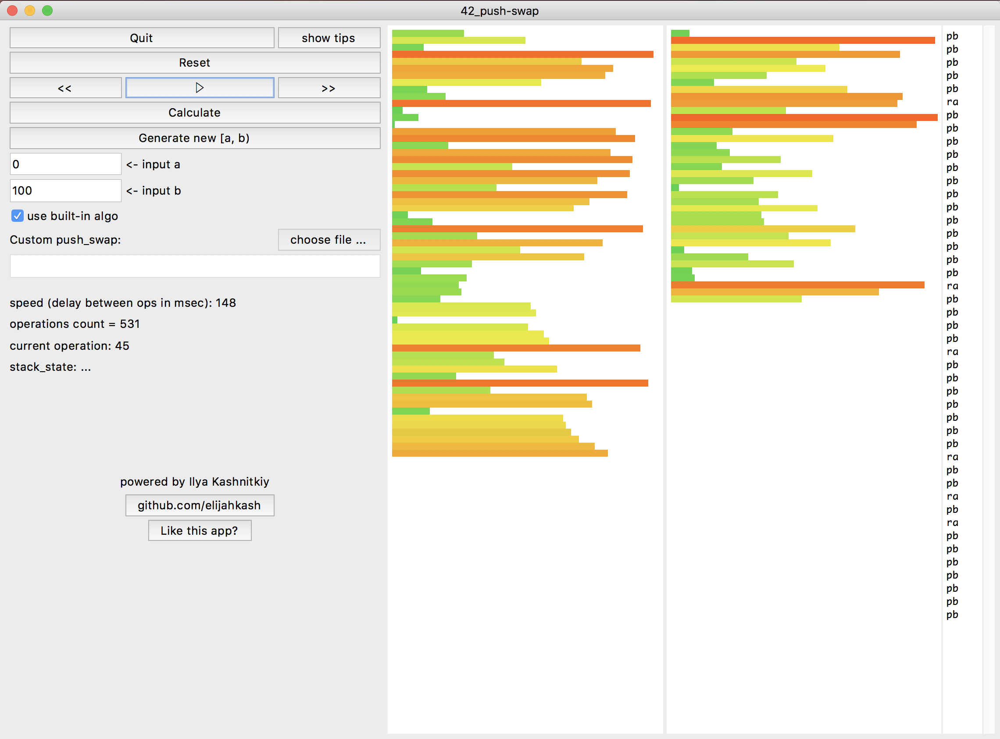

# *push_swap_gui*

Implementation of push-swap (42-school project) on python with GUI.



## Foreword

- Be welcome to use my project, `install`, `clone` and `fork` it!
- If you find a bug, please, create new `issue` (or contact with me in any way you want) to report about it! I will be glad to fix it! If you find a mistake in my spelling (because I'm from Russia, and English is not my native language), please notify me too!
- If you `clone/fork` this app and realise some new feature, you may create `pull request`! I am definitely interested in this!
- Also, I will be happy if you `follow` me, or `star` this project, ecpecially if you find it usefull, or use my code!
- For all questions be welcome to contact me in any way you want 👋
> Here is my  mail: _elijahkash.code@gmail.com_

## How to use:

### Install

This is a simple python3 package already added to PyPI. Therefore, to use you do not need to "clone" it from github. Just open terminal and run:

`> pip3 install push_swap_gui`

> If you have just started at school42 and have never encountered python and have difficulty installing the application, visit this page: https://github.com/elijahkash/push_swap_gui/wiki/FAQ_for_beginners

### Launch

Now you can run this application from any directory, and in two ways:

- `> python3 -m push_swap_gui`
- `> push_swap_gui`

### Import

You also may `import push_swap_gui` as a module. In this case, you can:

- `push_swap_gui.PushSwapGUI(master)` : create a window with app in tkinter item, transmitted as `master`
- `push_swap_gui.push_swap(src_data)` : this func get iterable with source data, and return list with comands (push-swap solve)

Example:
```
>>> import push_swap_gui
>>> a = [1, -1, 3, 7, 2, 9, 12]
>>> push_swap_gui.push_swap(a)
['pb', 'ra', 'ra', 'ra', 'pb', 'ra', 'ra', 'ra', 'pa', 'pa', 'rra']
>>>
```

### Uninstall

`> pip3 uninstall push_swap_gui`

## License
- See the [LICENSE](./LICENSE) file for license rights and limitations (MIT).

## Support
- If you like my activity, you may say “thank you” to me and support me for any amount! Use 'Sponsor' button in github!
